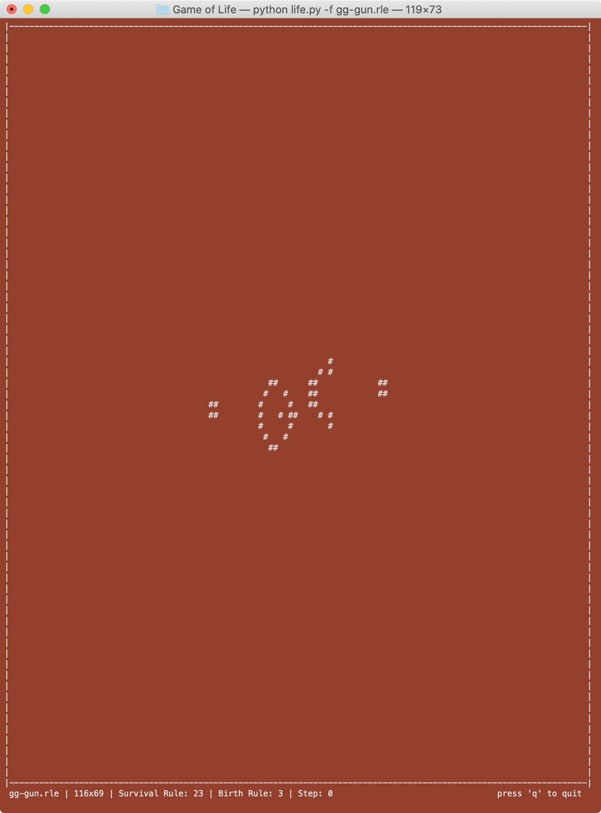

# Game of Life

I wrote this implementation of [Conway's Game of Life](https://en.wikipedia.org/wiki/Conway%27s_Game_of_Life) as one of [Robert Heaton's Programming Projects for Advanced Beginners](https://robertheaton.com/2018/07/20/project-2-game-of-life/). This probably doesn't follow good practices in all sorts of ways, because I'm still learning what those are.

I wrote a basic [**Run Length Encoded (RLE)**](https://www.conwaylife.com/wiki/Run_Length_Encoded) file parser so I could learn a little about parsing files. The parser looks for a [rulestring in B/S notation](https://www.conwaylife.com/wiki/Rulestring), allowing alternate cellular automaton rules like [Day and Night](https://en.wikipedia.org/wiki/Day_and_Night_(cellular_automaton)). A community at conwaylife.com provides tons of fascinating patterns in the RLE format. The parser currently does no error handling. 

*Gosper Glider Gun*

## Usage

### After you clone the project:

1. Run the requirements.txt: ```$ pip install -r requirements.txt```
2. Run life.py: ```$ python life.py -f 'gg-gun.rle'```

You may need to change your font and/or window size to see the whole simulation, or try reducing ```-rows``` and/or ```-columns```.

The following options are supported:
* ```-file [filename]```: Path to text file containing an [RLE pattern](https://www.conwaylife.com/wiki/Run_Length_Encoded)
* ```-ant```: implementation of [Langton's ant](https://en.wikipedia.org/wiki/Langton%27s_ant) starting with a dead board, wrapping onto itself (ignores other arguments)
* ```-rows [rows]```: number of rows of padding to add on top and bottom of RLE pattern (default=30)
* ```-columns [columns]```: number of columns to add to left and right of RLE pattern (default=40)
* ```-wrap```: wrap around edges instead of cutting off edges (giving cells on edge of grid neighbors on the opposite side)
* ```-delay [seconds]```: approximate time in seconds between each step (default=.02)

---

*Langton's Ant*


*Day and Night Spaceships*

---

Justin Reppert

Script was written on Python 3.7.4

Distributed under the MIT license. See ``LICENSE`` for more information.